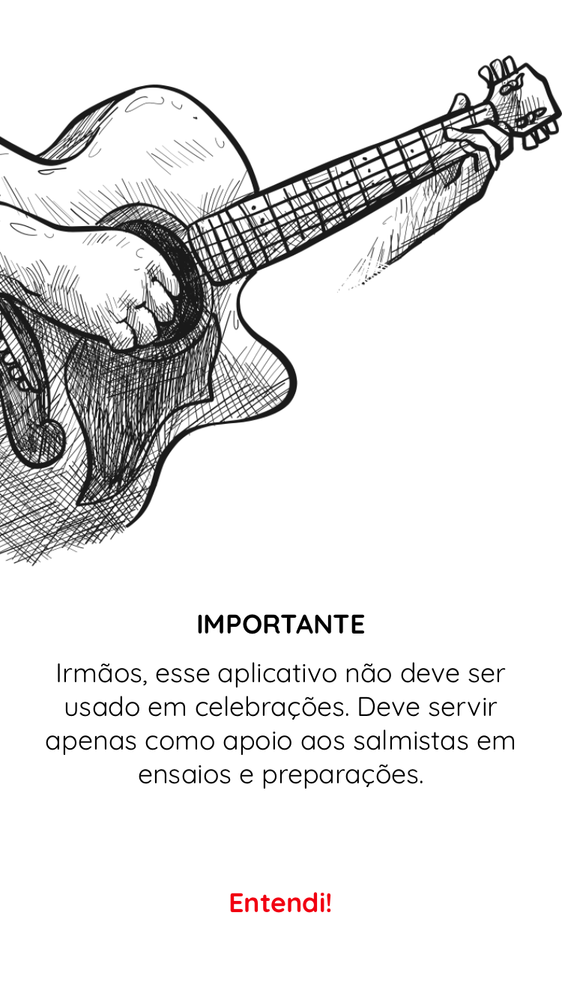
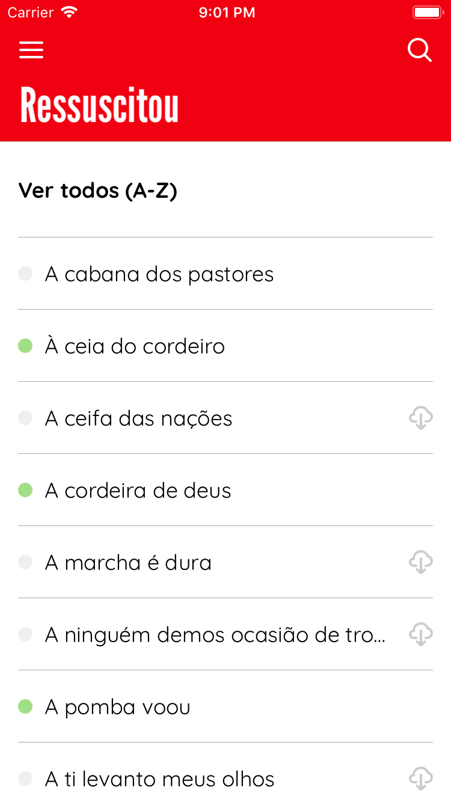
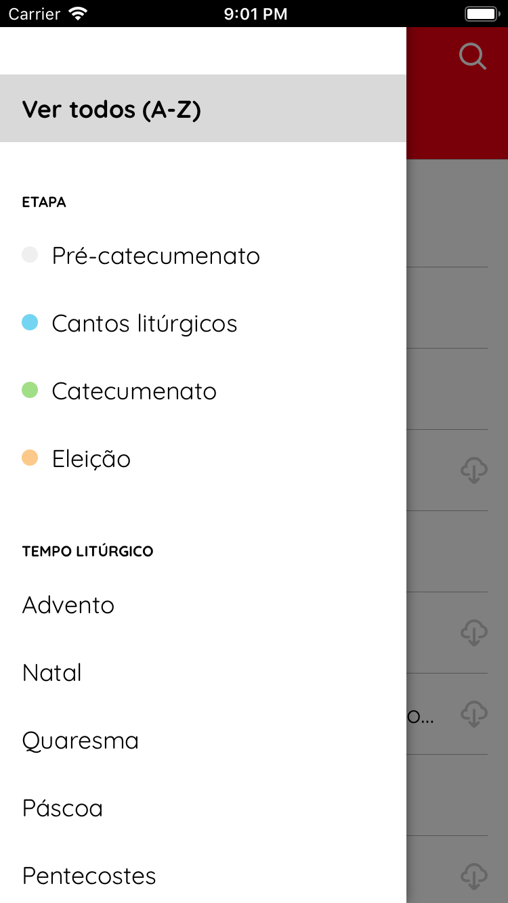
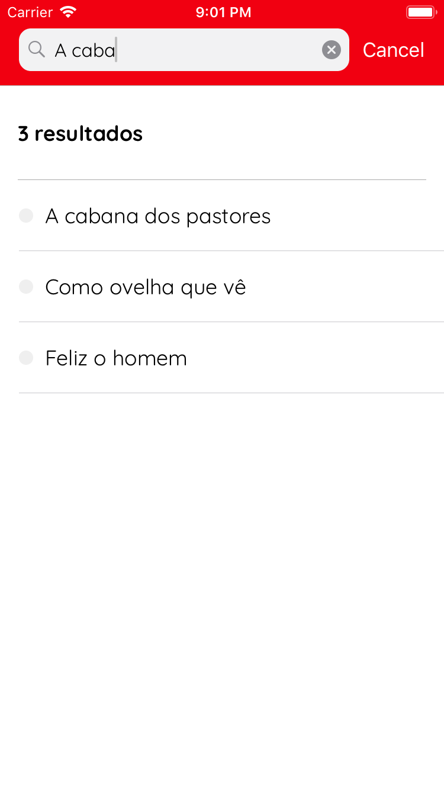
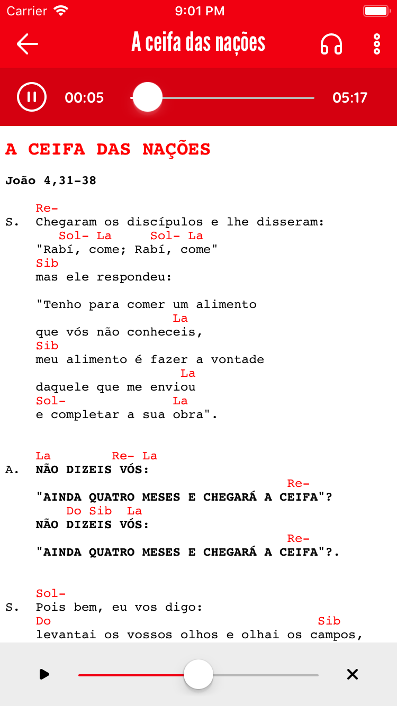

# Rescussitou-iOS

The iOS app for the Brazilian community of singers of the Neocatechumenal Way.

## Main features:
- Listing songs;
- Filtering songs;
- Searching songs;
- Viewing a song;
- Listening to the audio of the songs;

## App images:

## Credits
Many thanks to the contributors and volunteers in charge of developing and maintaining the <a href="https://github.com/otaviogrrd/Ressuscitou_Android">Android app</a>, which helped in the development by providing the json and html of the songs. A big thanks to <a href="https://github.com/rafaellucass">Rafael Lucas</a>, for providing us with this great UI and UX.
